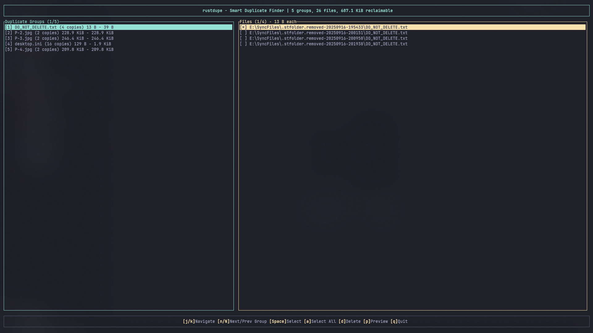

# RustDupe

[](https://github.com/MasuRii/RustDupe/actions/workflows/ci.yml)
[](https://crates.io/crates/rustdupe)
[](https://crates.io/crates/rustdupe)
[](https://opensource.org/licenses/MIT)
[](https://www.rust-lang.org)

**Smart Duplicate File Finder** — A high-performance, cross-platform duplicate file finder built in Rust with an interactive TUI.



---

## Table of Contents

- [Features](#features)
- [Installation](#installation)
- [Usage](#usage)
- [CLI Reference](#cli-reference)
- [Performance](#performance)
- [Contributing](#contributing)
- [License](#license)

## Features

- **High Performance**: Parallel directory walking and BLAKE3 hashing for maximum speed.
- **Hash Caching**: Persistent SQLite cache for lightning-fast rescans by skipping unchanged files.
- **Interactive TUI**: Review duplicate groups, preview files, and select copies for deletion with support for batch selection and themes.
- **Session Management**: Save and resume duplicate review sessions with checksum-verified integrity.
- **Reference Directories**: Protect original source directories from accidental deletion.
- **Advanced Export**: Generate self-contained HTML reports and safety-first shell scripts (POSIX/PowerShell).
- **Multi-Phase Optimization**:
  1. Group by file size (instant filtering).
  2. Compare 4KB pre-hashes (fast rejection).
  3. Full content hash for final confirmation.
  4. Optional byte-by-byte verification (paranoid mode).
- **Safe Deletion**: Moves files to system trash by default (cross-platform support).
- **Hardlink Aware**: Automatically detects and skips hardlinks (same inode) to prevent false positives.
- **Unicode Support**: Handles macOS NFD vs. Windows/Linux NFC normalization issues.
- **Theming**: Light, Dark, and Auto-detected terminal themes.

## Installation

### From crates.io (Recommended)

```bash
cargo install rustdupe
```

> **Requires Rust 1.85 or later.** Install Rust via [rustup](https://rustup.rs/).

### Pre-built Binaries

Download the latest release for your platform from the [GitHub Releases](https://github.com/MasuRii/RustDupe/releases) page.

| Platform | Architecture | Download |
|----------|--------------|----------|
| Linux | x86_64 | `rustdupe-*-x86_64-unknown-linux-gnu` |
| Linux (musl) | x86_64 | `rustdupe-*-x86_64-unknown-linux-musl` |
| macOS | x86_64 | `rustdupe-*-x86_64-apple-darwin` |
| macOS | Apple Silicon | `rustdupe-*-aarch64-apple-darwin` |
| Windows | x86_64 | `rustdupe-*-x86_64-pc-windows-msvc.exe` |

### From Source

```bash
git clone https://github.com/MasuRii/RustDupe.git
cd rustdupe
cargo build --release
```

The binary will be available at `target/release/rustdupe`.

## Usage

### Basic Scan (Interactive TUI)

```bash
rustdupe scan ~/Downloads
```

### Incremental Scanning (Cache)

Speed up subsequent scans of the same directories by enabling the persistent hash cache.

```bash
# Uses default platform-specific cache path
rustdupe scan ~/Documents

# Specify a custom cache path
rustdupe scan ~/Documents --cache ./my-hashes.db

# Force a full rescan by clearing the cache
rustdupe scan ~/Documents --clear-cache
```

### Workflow Persistence (Sessions)

Save your progress and resume your duplicate review later.

```bash
# Save scan results to a session file
rustdupe scan ~/Photos --save-session backup.json

# Load and resume a session in the TUI
rustdupe load backup.json

# Load a session and export to a different format
rustdupe load backup.json --output html --output-file report.html
```

### Protected Paths (Reference Directories)

Protect "golden" copies of your files. Files in reference directories are never selected by batch operations and cannot be manually selected for deletion.

```bash
rustdupe scan ./working-dir --reference ./backup-drive/originals
```

### Advanced Export (Reports & Scripts)

Generate self-contained HTML reports for sharing or shell scripts for automated/reviewed deletion.

```bash
# Generate a responsive HTML report with summary stats
rustdupe scan ~/Downloads --output html > report.html

# Generate a POSIX deletion script (dry-run by default)
rustdupe scan ~/Downloads --output script --script-type posix > cleanup.sh

# Generate a PowerShell deletion script
rustdupe scan ~/Downloads --output script --script-type powershell > cleanup.ps1
```

### Advanced Filtering

Narrow down results using size, date, regex, or file type categories.

```bash
# Filter by size and date range
rustdupe scan . --min-size 1MB --newer-than 2025-01-01 --older-than 2026-01-01

# Use regex for inclusion/exclusion
rustdupe scan . --regex "IMG_.*\.jpg" --regex-exclude ".*_backup\..*"

# Filter by file type categories
rustdupe scan . --file-type images --file-type videos
```

### Dry-Run Mode

Analyze duplicates safely without any risk of modification. Deletion actions are disabled in the TUI.

```bash
rustdupe scan . --dry-run
```

## CLI Reference

```text
Usage: rustdupe [OPTIONS] <COMMAND>

Commands:
  scan  Scan a directory for duplicate files
  load  Load a previously saved session
  help  Print this message or the help of the given subcommand(s)

Options:
  -v, --verbose...           Increase verbosity level (-v for debug, -vv for trace)
  -q, --quiet                Suppress all output except errors
      --no-color             Disable colored output
      --theme <THEME>        TUI theme (light, dark, auto) [default: auto]
  -h, --help                 Print help
  -V, --version              Print version

Scan Subcommand Options:
  -o, --output <OUTPUT>      Output format (tui, json, csv, html, session, script) [default: tui]
      --output-file <PATH>   Write output to a file instead of stdout
      --script-type <TYPE>   Type of deletion script to generate (posix, powershell)
      --min-size <SIZE>      Minimum file size to consider (e.g., 1KB, 1MB)
      --max-size <SIZE>      Maximum file size to consider (e.g., 1KB, 1MB)
      --newer-than <DATE>    Only include files modified after (YYYY-MM-DD)
      --older-than <DATE>    Only include files modified before (YYYY-MM-DD)
      --regex <PATTERN>      Regex patterns to include (alias: --regex-include)
      --regex-exclude <PAT>  Regex patterns to exclude
      --file-type <TYPE>     Filter by categories (images, videos, audio, documents, archives)
  -i, --ignore <PATTERN>     Glob patterns to ignore
      --follow-symlinks      Follow symbolic links
      --skip-hidden          Skip hidden files and directories
      --io-threads <N>       Number of I/O threads for hashing [default: 4]
      --paranoid             Enable byte-by-byte verification
      --permanent            Use permanent deletion instead of trash
  -y, --yes                  Skip confirmation prompts
      --cache <PATH>         Path to the hash cache database
      --no-cache             Disable hash caching
      --clear-cache          Clear the hash cache before scanning
      --dry-run              Do not perform any deletions (alias: --analyze-only)
      --reference <PATH>     Reference directories (protected from deletion)
```

### TUI Key Bindings

| Key | Action |
|-----|--------|
| `↑/↓` or `j/k` | Navigate files and groups |
| `Space` | Toggle selection for current file |
| `Enter` | Preview current file (external opener) |
| `A` | Select all duplicates (keep first) across ALL groups |
| `O` | Select oldest file in each group (keep newest) |
| `N` | Select newest file in each group (keep oldest) |
| `S` | Select all but largest file in each group |
| `L` | Select all but smallest file in each group |
| `F` | Enter folder-based selection mode |
| `Delete` | Delete selected files (moves to trash by default) |
| `t` | Toggle between Light and Dark themes |
| `q` or `Esc` | Quit / Go back |


## Performance

RustDupe is optimized for speed through several techniques:

| Technique | Benefit |
|-----------|---------|
| **BLAKE3 hashing** | 2.8-10x faster than SHA-256, with multi-threaded scaling |
| **Parallel directory walking** | Uses `jwalk` for 4x faster traversal than sequential walking |
| **Multi-phase deduplication** | Early rejection via size grouping and 4KB pre-hashes |
| **Work-stealing thread pool** | Near-linear scaling with CPU cores via Rayon |

### Benchmarks

On a typical workstation (8-core CPU, NVMe SSD):

| Dataset | Files | Total Size | Time |
|---------|-------|------------|------|
| Home directory | ~50,000 | 100 GB | ~15s |
| Photo library | ~20,000 | 200 GB | ~25s |
| Source code | ~100,000 | 10 GB | ~5s |

> **Note**: Actual performance varies based on disk speed, file sizes, and duplicate ratio.

## Contributing

Contributions are welcome! Please read our [Contributing Guidelines](CONTRIBUTING.md) before submitting a Pull Request.

### Quick Start

1. Fork the repository
2. Create your feature branch (`git checkout -b feature/amazing-feature`)
3. Commit your changes (`git commit -m 'feat: add amazing feature'`)
4. Push to the branch (`git push origin feature/amazing-feature`)
5. Open a Pull Request

See [CONTRIBUTING.md](CONTRIBUTING.md) for detailed guidelines on:
- Development setup
- Code style and linting
- Testing requirements
- Commit message conventions

## Security

For security vulnerabilities, please see our [Security Policy](SECURITY.md).

## License

Distributed under the MIT License. See [LICENSE](LICENSE) for more information.

---

<p align="center">
  Made with ❤️ in Rust
</p>
